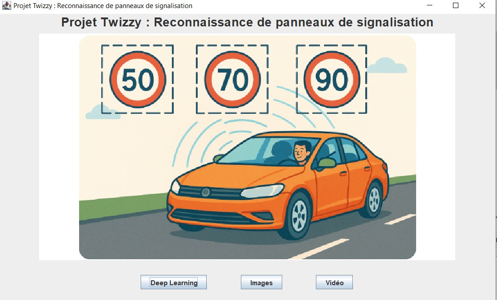

# Projet Twizzy

L'objectif de ce projet est de créer une interface pour détecter les panneaux de signalisation avec OpenCV en première partie et avec Deep Learning CNN en deuxième partie.

## Détection des panneaux de signalisation avec OpenCV

## Classification de Panneaux Routiers avec CNN

Ce projet implémente un modèle de classification de panneaux routiers utilisant une architecture ResNet.

### URL du projet déployé partie Deep Learning

L'application est déployée sur Render :  
🌐 [https://cnn-3.onrender.com/](https://cnn-3.onrender.com/)

### Technologies utilisées

#### Backend

- Python
- Flask (serveur web)
- PyTorch (modèle de deep learning)
- ResNet (architecture CNN)
- Waitress (serveur WSGI pour la production)

#### Frontend

- HTML/CSS
- JavaScript vanilla
- API Fetch pour les requêtes

## Installation

-Le projet Twizzy se traduit par une interface qui exige l'installation de OpenCV 2.4.9
